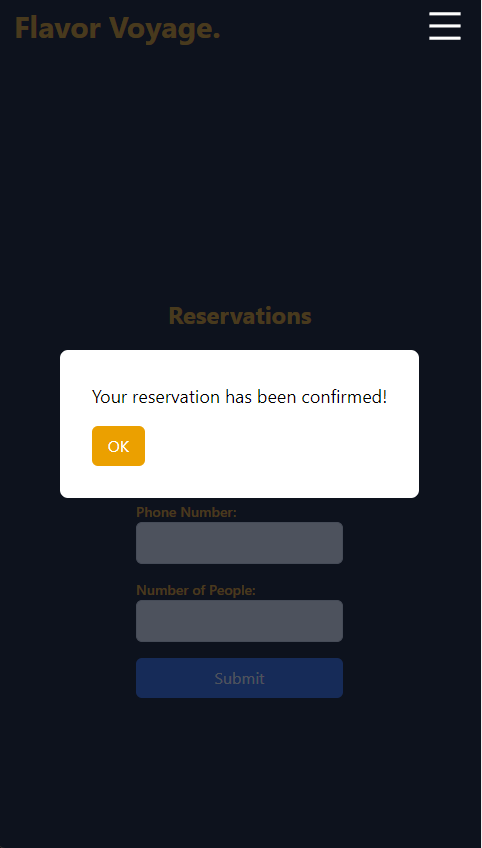

# User Guide for Website Navigation

## Introduction
Welcome to our website! This user guide will help you navigate through the different sections and features of our website.

## Table of Contents
1. [Homepage](#homepage)
2. [Navigation Menu](#navigation-menu)
3. [Reservations](#reservations)
4. [Private Events](#private-events)
5. [About Us](#about-us)
6. [Contact Us](#contact-us)

## Homepage
Upon visiting our website, you will land on the homepage. A title and animated gallery will be displayed and at the top will be shown navigation bar.
### Desktop View
Here's how our homepage looks like on desktop devices:

### Mobile View
For mobile users, the homepage is optimized for a seamless browsing experience:

## Navigation Menu
Our website features a navigation menu located at the top of the page. You can use this menu to access different sections of the website, such as the menu, reservations, private events, about us, and contact us.
### Desktop View
Here's how our navigation bar looks like on desktop devices:

### Mobile View
For mobile users, the navbar is hidden and there is a mega menu button:
  
after clicking on it, the navbar will be displayed: 

## Reservations
To make a reservation at our restaurant, navigate to the "Reservations" section in the navigation menu. Fill out the reservation form with your name, email, phone number, and the number of people in your party. Then, click the "Submit" button to confirm your reservation.

### Desktop View
Here's how our reservations page looks like on desktop devices:

### Mobile View
For mobile users:

 
after successfull reservation you will get :  

## Private Events
If you're interested in hosting a private event at our restaurant, you can do so by visiting the "Private Events" section. Fill out the private events reservation form with your event details, including your name, email, phone number, event type, and the number of attendees.

## About Us
Learn more about our restaurant by visiting the "About Us" section. Here, you will find information about our history, mission, values, and team members.

## Contact Us
Have questions or feedback? Visit the "Contact Us" section to get in touch with our team. You can fill out the contact form with your name, email, phone number, and message, and we'll get back to you as soon as possible.

## Conclusion
We hope this user guide helps you navigate our website effectively. If you have any further questions or need assistance, feel free to reach out to us via the contact form. Enjoy your browsing experience!
